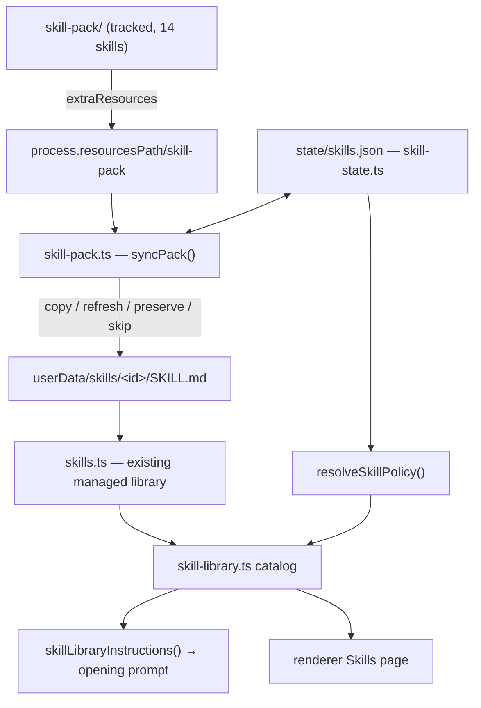
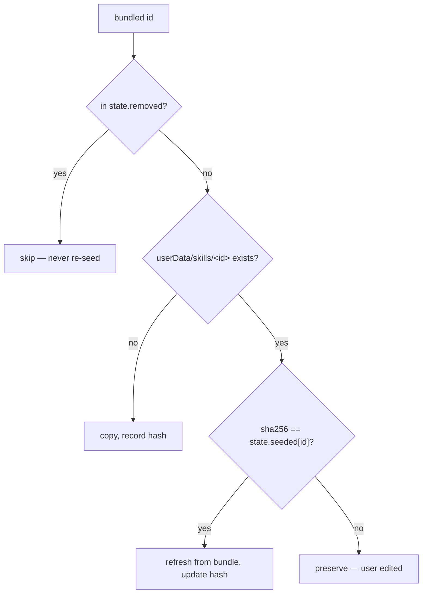

# ChatBBC Superpowers Skill Pack — Design

**Date:** 2026-09-18
**Status:** Approved (design in chat approved by user; this document is the written form)
**Plan:** `docs/superpowers/plans/2026-09-18-chatbbc-skill-pack.md`

## 1. Problem

Jesse Vincent's `obra/superpowers` skill library (MIT) is a proven process toolkit: it
tells an agent *how* to approach work — brainstorm before building, write a plan, test
first, verify before claiming success. ChatBBC already has almost all the **machinery**
to deliver such skills to ChatGPT: a managed skill library, `/` completion, removable
chips, a bounded prompt fitter, and a catalog injected into the opening prompt.

What ChatBBC does not have is the **content**, nor a way to **control** it:

1. **The content is not reachable.** `skill-library.ts` reads every candidate through
   `sandbox.approved()`, which requires the path be inside an approved root. A user's
   `~/.agents/skills` normally is not. Verified by isolation probe: with `HOME` outside
   the approved roots the catalog is **empty**; approving the home tree makes the skill
   appear — but only as `brainstorming--user-546c724d01cd`, which is a poor `/` command.
2. **Enable/disable is not app-owned.** The only `enabled` input today is the external
   Codex `config.toml` (`parseSkillConfiguration` → `config.rules`). ChatBBC's Settings
   cannot write that file, so no in-app toggle can exist.
3. **The bodies address another harness.** Measured across the 51 upstream files: 9
   reference a `superpowers:` namespace, 5–7 reference Claude, 2 reference `TodoWrite`.
   Shipped verbatim, ChatGPT is told to call tools that do not exist in ChatBBC.

## 2. Goals

- Ship 14 curated Superpowers skills as a working, app-owned pack.
- Give the user a real on/off switch per skill, plus a separate implicit-invocation
  switch, both owned by ChatBBC rather than by an external file.
- Expose the pack in the UI so a 15 KB body is never sent blind.
- Adapt the bodies to ChatBBC's actual tool vocabulary.
- Satisfy the licence and privacy gates honestly.

## 3. Non-goals (this cut)

- The brainstorming visual-companion **server** (`scripts/server.cjs`, `start-server.sh`).
  Scripts stay inert resources, consistent with `AGENTS.md` §6.
- Mid-chat catalog refresh. The catalog remains opening-scoped.
- Any new Windows/macOS-only code path (`AGENTS.md` platform rule).
- Upstream's `find-skills`, `computer-use`, `omarchy`, `diagnose-crash` — those drive
  *this* desktop, not a project workflow.

## 4. Decisions

### 4.1 Delivery: a bundled, tracked pack mirrored into the managed library

The pack lives at repo-root **`skill-pack/`** (tracked, shipped verbatim, like
`extension/`). `resources/` is **not** usable: it is gitignored build staging.

Packaged builds mirror it into the existing managed library at
`<userData>/skills/<id>/`, exactly as `extension-path.ts` mirrors the extension. The
mirror is required, not stylistic: `extension-path.ts` documents that
`process.resourcesPath` lives in a **temporary mount on AppImage that disappears when the
app exits**, so a skill root pointed at it could not be a stable `/skills` path.

This choice inherits, unchanged: `/` completion, chips, the catalog, the prompt fitter
with its token budgeting, and `read /skills/<id>/…` for sibling files. It also yields
clean ids — `/brainstorming`, not `/brainstorming--user-546c724d01cd`.

### 4.2 One durable owner for pack provenance and user intent

New owner `src/main/skill-state.ts` owns `state/skills.json`:

```ts
interface SkillState {
  version: 1;
  /** id -> sha256 of the SKILL.md this app last wrote. Provenance, not authority. */
  seeded: Record<string, string>;
  /** User enablement. Absent = inherit. */
  enabled: Record<string, boolean>;
  /** User implicit-invocation choice. Absent = inherit. */
  implicit: Record<string, boolean>;
  /** Bundled ids the user removed. Never re-seeded. */
  removed: string[];
}
```

One file, one serialized mutation owner, so provenance and the tombstone cannot diverge.
Deliberately **not** merged into the renderer's `{base, patch}` settings path: that merge
is field-wise, so a `Record<id, …>` would let toggling skill A clobber skill B.

### 4.3 Enablement precedence — one resolver, layered inputs

```
app explicit  >  external Codex rule  >  skill declaration  >  default (on)
```

This mirrors the fresh-default / legacy-omit / malformed-recovery layering
`effectiveCapabilities()` already uses. The external Codex rules are kept as a *lower*
precedence input rather than deleted — dropping a working feature would be an
unrequested regression. The skill's own `allow_implicit_invocation` from
`agents/openai.yaml` remains the declaration layer.

### 4.4 Implicit invocation

Already wired: `allowImplicitInvocation` gates catalog membership and the model can read
`/skills/<id>/SKILL.md` itself. The gap is that the catalog text only advertises explicit
`/<id>` selection. Add one sentence legitimising proactive reading, **gated on the user's
implicit switch**, so turning it off removes the invitation as well as the row.

Honest limitation, stated in the UI copy: the catalog is frozen into an **opening**
prompt, so implicit invocation is opening-scoped, not available mid-chat.

### 4.5 An adapted copy, not a verbatim copy

Bodies are adapted to ChatBBC's tool surface. Mapping (grounded in `AGENTS.md` §6):

| Upstream | ChatBBC |
|---|---|
| `superpowers:<skill>` | `/<skill>` |
| Claude, claude | ChatGPT |
| `TodoWrite` | `update_plan` |
| Task tool / subagents | `agents action=spawn\|message` |
| `Read` / `Edit` / `Write` | `read` / `apply_patch` |
| `Bash` | `exec_command`, `write_stdin`, `cmds` |
| `Grep` / `Glob` | `find`, or ripgrep via `exec_command` |
| plan mode | `update_plan` |

`subagent-driven-development` and `dispatching-parallel-agents` need a real rewrite, not a
rename: they assume local code subagents, while ChatBBC workers are **browser ChatGPT
conversations** in a star topology that cannot spawn descendants (`AGENTS.md` §16). The
adapted text must state that constraint rather than imply parity.

### 4.6 Licence and privacy

MIT, © 2025 Jesse Vincent — bundling is permitted. Attribution follows the **existing
Codex precedent**: a licence directory plus a block in
`scripts/generate-third-party-notices.mjs`, whose `--check` is deterministic and
currently passes. The 11 MB `THIRD-PARTY-NOTICES.txt` is regenerated by that script, never
hand-edited. The vendored pack was checked against every string the privacy guard blocks — the
maintainer's private address, the Claude session trailer and the claude.ai session URL form, and
the private Windows user path — and matches none of them. That check is performed by running the
guard itself; the values are deliberately not restated here, because the guard rejects any file
that contains them, including one that merely quotes them.

## 5. Architecture



## 6. Components

| File | Responsibility |
|---|---|
| `skill-pack/**` | Tracked vendored content: 14 adapted skills, `LICENSE`, `PROVENANCE.md`. |
| `src/main/skill-pack.ts` | Locates the bundled pack; decides seed / refresh / preserve / skip. |
| `src/main/skill-state.ts` | Owns `state/skills.json`; serialized mutations; policy resolution. |
| `src/main/skill-library.ts` | Modified: consults the resolver; suppresses duplicated bundled names. |
| `src/main/skills.ts` | Modified: exposes the pack-aware removal path. |
| `src/main/mcp/instructions.ts` | Unchanged; consumes the already-modified catalog text. |
| `src/main/ipc.ts`, `src/preload/index.ts` | Modified: `skills:state`, `skills:set`, `skills:reset`. |
| `src/renderer/skills-library.ts` | New: the Skills settings section. |
| `electron-builder.yml` | Modified: ship `skill-pack/`. |
| `scripts/generate-third-party-notices.mjs` | Modified: Superpowers attribution block. |

## 7. Data flow

**Seeding (launch).** `initSkillsPath` resolves the root (unchanged position). After
`initDurableStore`, `syncSkillPack()` runs. Per bundled id, in this order:



Every branch is observable and tested. A malformed bundle entry (missing frontmatter,
oversized, invalid UTF-8) is refused with a logged warning and leaves the existing
library intact rather than half-seeding.

**Resolution.** `listSkillLibrary()` asks `resolveSkillPolicy()` per skill and omits
disabled skills. A discovered (non-managed) skill whose name collides with a bundled
managed skill is suppressed, so approving `~/.agents` later cannot list the unadapted
`brainstorming--user-…` beside the curated `/brainstorming`.

## 8. Error handling

- Pack absent or unreadable → log a warning, keep serving the current library. Never a
  hard start failure; this mirrors `initSkillsPath`'s existing try/catch.
- Individual skill invalid → skip that skill, report it in `library.errors` like every
  other discovery failure.
- State file missing/corrupt → read as empty (inherit-all), consistent with
  `readDurable`'s documented contract.
- Removal → write the tombstone and move the directory in one serialized operation.

## 9. Testing

| Layer | Test |
|---|---|
| Pack content | Every skill has valid frontmatter, fits the 128 KB / 96 K-char limits, uses only ChatBBC tool names, and ids resolve through `skillDirectives`. |
| Seeding | Decision table: fresh, unmodified-refresh, user-edited-preserved, removed-skips, removed-then-reinstall. |
| Precedence | Resolution table incl. negatives: explicit-off beats rule; rule beats declaration; absent inherits on. |
| Removal | Tombstone and directory move agree; a removed skill never re-seeds. |
| Duplicate suppression | A discovered skill shadowing a bundled id is omitted. |
| UI | Real-Electron fixture: toggles persist, search finds the section, preview renders and is bounded. Requires `--ozone-platform=x11 --disable-gpu --in-process-gpu` on this machine. |
| Live | Launch the built app; toggle a skill off and on; confirm `/` lists it and the delivered prompt carries the body only when enabled. |

Existing suites that must keep passing: `test/skills.test.ts`,
`test/skill-library.test.ts`, `test/skill-metadata.test.ts`,
`test/skills-integration.test.ts`, `test/renderer-skills.test.ts`.

## 10. Risks

| Risk | Mitigation |
|---|---|
| Adapted bodies drift from upstream | `PROVENANCE.md` pins commit `b36e0829`; refresh is a reviewed diff, not a copy. |
| A user editing a bundled skill loses work on upgrade | Hash comparison preserves edited files by design; "Restore original" is explicit. |
| Catalog text grows past its token budget | The existing `maxContextTokens` bound already truncates with an explicit notice. |
| Two skills both claiming to be "the" workflow | Presets were considered and **deferred** — YAGNI until per-skill toggles are in use. |
