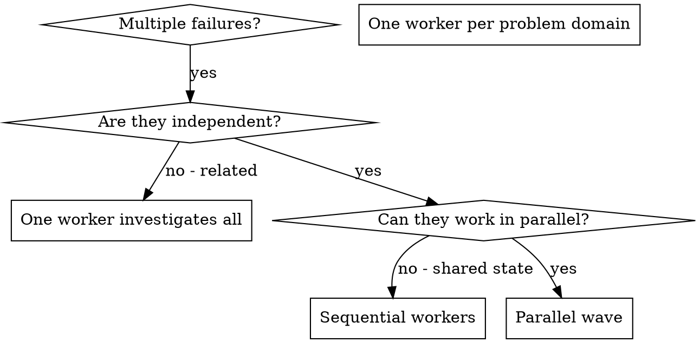

# Dispatching Parallel Agents

## Overview

You delegate tasks to worker conversations with isolated context. By precisely crafting their instructions and context, you ensure they stay focused and succeed at their task. A worker never inherits your session's context or history — you construct exactly what it needs. This also preserves your own context for coordination work.

When you have multiple unrelated failures (different test files, different subsystems, different bugs), investigating them sequentially wastes time. Each investigation is independent and can happen in parallel.

**Core principle:** One worker per independent problem domain. Let them work concurrently.

## How agents work in ChatBBC

The `agents` tool manages **worker conversations**, which are separate ChatGPT chats driven by
a browser tab. Three constraints shape everything below:

1. **Star topology.** A worker reports to the prime that spawned it. Workers cannot spawn
   workers, so all fan-out is one level deep and you are the only dispatcher.
2. **Browser-bound.** Each worker needs an attached ChatGPT page. Spawning is not instant, and
   a worker can be asleep, detached or terminated.
3. **At-least-once messaging.** Reports and messages carry durable identities, so a retry does
   not duplicate work, but you must match a report to the assignment it answers.

ChatBBC's practical parallelism is therefore bounded by the user's configured worker cap:
**default 2 workers per prime family, hard max 8**. Spawning beyond the cap fails rather than
queueing, so size the batch to the cap and run the rest as a second wave. Reuse a sleeping
worker with `agents action=message` before spawning a replacement.

## When to Use



**Use when:**
- 3+ test files failing with different root causes
- Multiple subsystems broken independently
- Each problem can be understood without context from others
- No shared state between investigations

**Don't use when:**
- Failures are related (fix one might fix others)
- Need to understand full system state
- Workers would interfere with each other

## The Pattern

### 1. Identify Independent Domains

Group failures by what's broken:
- File A tests: Tool approval flow
- File B tests: Batch completion behavior
- File C tests: Abort functionality

Each domain is independent - fixing tool approval doesn't affect abort tests.

### 2. Create Focused Worker Tasks

Each worker gets:
- **Specific scope:** One test file or subsystem
- **Clear goal:** Make these tests pass
- **Constraints:** Don't change other code
- **Expected output:** Summary of what you found and fixed

### 3. Spawn in Parallel

Spawn the workers in one `agents action=spawn` call, passing shared instructions once in
`context` and each worker's own job in `workers[]`:

```text
agents action=spawn
  context: "<shared repository, conventions, edit limits, validation>"
  workers: [
    { label: "Abort",   task: "Fix agent-tool-abort.test.ts failures. <scope, constraints, expected handoff>" },
    { label: "Batch",   task: "Fix batch-completion-behavior.test.ts failures. <...>" }
  ]
```

One call, not one call per problem: a second spawn for the same wave creates fresh chats that
compete for the same cap. If the list is longer than the user's worker cap (default 2, hard max
8), dispatch the first wave, wait for reports, then reuse sleeping workers with
`agents action=message` for the rest.

Reports arrive on later tool results — never poll for them. Keep working while a wave runs.

### 4. Review and Integrate

When workers report:
- Read each report, and match it to the assignment it answers — a report is a claim, not proof
- Verify the changes against the repository: read the diff, and run the tests the report names
- Verify fixes don't conflict
- Run the suite the changed areas belong to
- Integrate all changes

## Worker Prompt Structure

Good worker tasks are:
1. **Focused** - One clear problem domain
2. **Self-contained** - All context needed to understand the problem
3. **Specific about output** - What should the worker return?

```markdown
Fix the 3 failing tests in src/agents/agent-tool-abort.test.ts:

1. "should abort tool with partial output capture" - expects 'interrupted at' in message
2. "should handle mixed completed and aborted tools" - fast tool aborted instead of completed
3. "should properly track pendingToolCount" - expects 3 results but gets 0

These are timing/race condition issues. Your task:

1. Read the test file and understand what each test verifies
2. Identify root cause - timing issues or actual bugs?
3. Fix by:
   - Replacing arbitrary timeouts with event-based waiting
   - Fixing bugs in abort implementation if found
   - Adjusting test expectations if testing changed behavior

Do NOT just increase timeouts - find the real issue.

Return: Summary of what you found and what you fixed.
```

## Common Mistakes

**❌ Too broad:** "Fix all the tests" - worker gets lost
**✅ Specific:** "Fix agent-tool-abort.test.ts" - focused scope

**❌ No context:** "Fix the race condition" - worker doesn't know where
**✅ Context:** Paste the error messages and test names

**❌ No constraints:** Worker might refactor everything
**✅ Constraints:** "Do NOT change production code" or "Fix tests only"

**❌ Vague output:** "Fix it" - you don't know what changed
**✅ Specific:** "Return summary of root cause and changes"

## When NOT to Use

**Related failures:** Fixing one might fix others - investigate together first
**Need full context:** Understanding requires seeing entire system
**Exploratory debugging:** You don't know what's broken yet
**Shared state:** Workers would interfere (editing same files, using same resources)

## Real Example from Session

**Scenario:** 6 test failures across 3 files after major refactoring

**Failures:**
- agent-tool-abort.test.ts: 3 failures (timing issues)
- batch-completion-behavior.test.ts: 2 failures (tools not executing)
- tool-approval-race-conditions.test.ts: 1 failure (execution count = 0)

**Decision:** Independent domains - abort logic separate from batch completion separate from race conditions. With the default worker cap of 2, the three domains run as two waves rather than three concurrent workers.

**Waves:**
```text
Wave 1 — agents action=spawn, workers: [
  { label: "Abort", task: "Fix agent-tool-abort.test.ts" },
  { label: "Batch", task: "Fix batch-completion-behavior.test.ts" }
]

Wave 2 — after a report frees a slot, agents action=message to a sleeping worker:
  "Fix tool-approval-race-conditions.test.ts"
```

**Results:**
- Worker 1: Replaced timeouts with event-based waiting
- Worker 2: Fixed event structure bug (threadId in wrong place)
- Worker 1 (reused): Added wait for async tool execution to complete

**Integration:** All fixes independent, no conflicts, full suite green

## Verification

After workers report:
1. **Review each report** - Understand what changed
2. **Check for conflicts** - Did workers edit the same code?
3. **Run the suite** - Verify all fixes work together
4. **Spot check** - Workers can make systematic errors
